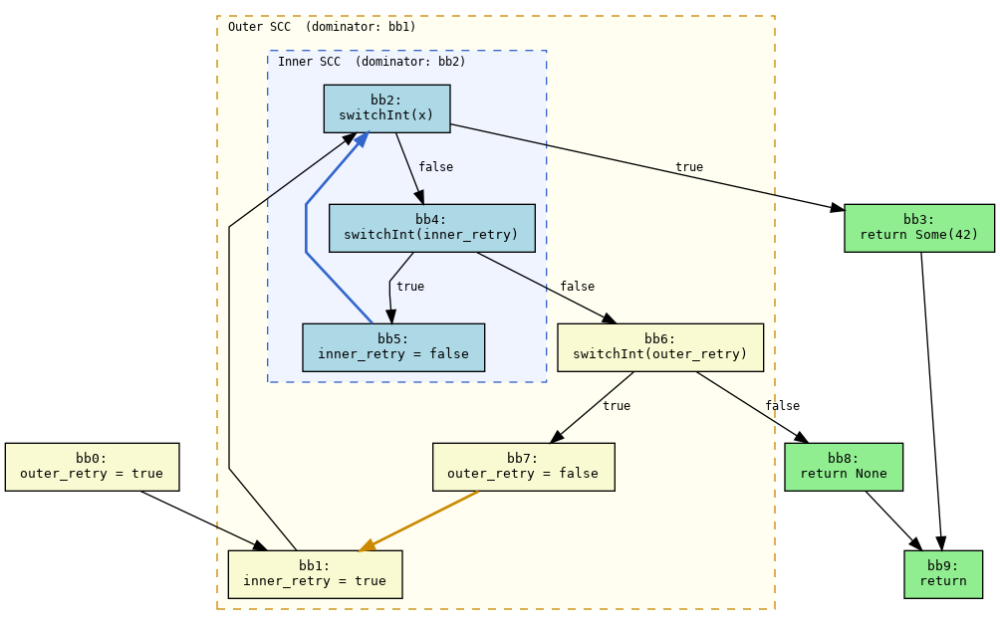
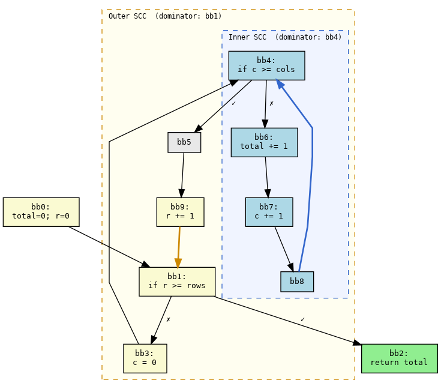

# Chapter 5.1. Path Analysis

Path analysis extracts finite, acyclic execution paths from a function's control-flow graph (CFG). It is a foundational module — the [alias analysis](./5.2-alias.md), [SafeDrop dangling pointer detection](./6.1-dangling.md), [range analysis](./5.7-range.md), and the [verification pipeline](./8-verification.md) all depend on the path enumeration and reachability checking infrastructure provided by this module. The implementation lives at [`rapx/src/analysis/path_analysis/`](https://github.com/safer-rust/RAPx/blob/main/rapx/src/analysis/path_analysis/).

## 5.1.1 Motivation: Meet-Over-Paths Analysis

Traditional dataflow analysis frameworks typically use **chaotic iteration** — a MOP (Merge Over Paths) approach that iteratively propagates abstract states across all CFG edges until convergence. For languages with simple branch conditions (e.g., integer comparisons), this works well because the state space is compact and every edge is reachable under some input.

Rust presents a fundamentally different challenge: `enum` types produce correlated branch conditions that make many structurally possible paths mutually exclusive. Consider a function that pattern-matches the same `Option<T>` or `Result<T,E>` twice:

```rust
fn example(x: Option<i32>) -> i32 {
    let a = match x {
        Some(_) => 1,
        None => -1,
    };
    match x {
        Some(_) => a + 1,
        None => a - 1,
    }
}
```

Structurally, the CFG has 2 × 2 = 4 paths through the two `match` statements. But only 2 are actually reachable: if `x` was `Some` at the first match, it must also be `Some` at the second. The possible return values are `1 + 1 = 2` and `-1 - 1 = -2`. A chaotic-iteration analysis treats all edges as independent and would merge abstract states from all four routes at every join point, losing the correlation that both `match` statements depend on the same `x`. This over-approximation produces spurious state combinations — for instance, the crossed paths would suggest return values of `1 - 1 = 0` and `-1 + 1 = 0`, making `0` a false positive that compounds with each additional `match` or `if let` in the function.

Path analysis addresses this by explicitly enumerating CFG paths and then filtering them with discriminant-constraint checking. Each surviving path carries a consistent set of branch decisions, and downstream analyses process each path independently without merging incompatible states. This is the essence of the meet-over-paths approach: the meet (merge) operation is applied over a set of *validated* paths rather than over all structurally possible edges.

## 5.1.2 Path Extraction

Given a MIR function body, the path extraction module answers: *what are all the structurally possible CFG paths from function entry to each exit point?* The key challenge is loops: each strongly connected component (SCC) in the CFG introduces cyclic back-edges that make a naive enumeration unbounded. RAPx solves this by decomposing SCCs into a hierarchical tree and applying controlled unrolling.

### 5.1.2.1 Natural Loops and SCC Trees

The key insight enabling finite path enumeration is that every loop in Rust MIR is a natural loop. A natural loop has a single dominator (entry block) through which all paths into the loop must pass. This property enables constructing a hierarchical SCC tree:

1. SCC Detection: The CFG is decomposed into strongly connected components (SCCs). Each SCC corresponds to a loop region.
2. Dominator Identification: For each SCC, the block that dominates all SCC members is the loop's entry.
3. SCC Tree Construction: Nested SCCs form a tree — the outermost SCC is the root, children are nested sub-SCCs, and further nesting continues recursively.

```
         ┌──────────────────────────────────┐
         │  Outer SCC (root)                │
         │  dominator: bb1                  │
         │  ┌──────────────────────────┐    │
         │  │ Inner SCC A (child)      │    │
         │  │ dominator: bb7           │    │
         │  └──────────────────────────┘    │
         │  ┌──────────────────────────┐    │
         │  │ Inner SCC B (child)      │    │
         │  │ dominator: bb12          │    │
         │  └──────────────────────────┘    │
         └──────────────────────────────────┘
```

The SCC tree enables top-down recursive unfolding: starting from the outermost SCC, the analysis descends into child SCCs and splices their enumerated internal paths as atomic segments into parent paths. This top-down approach also propagates accumulated path constraints from outer contexts into inner SCCs, so inner path enumeration only explores paths consistent with the outer context.

### 5.1.2.2 Controlled Loop Unrolling

To keep enumeration finite, the `check_postfix_segment` mechanism tracks path segments between successive visits to the same SCC dominator:

- A postfix segment is the block sequence from one visit to the SCC dominator until the next visit to that same dominator.
- Each distinct postfix segment is counted. The first occurrence is always allowed; subsequent occurrences are limited to `postfix_repeat` times. Beyond that, the branch is pruned.
- `postfix_repeat = 0` (default): each distinct segment appears at most once (the initial occurrence), producing the minimum set of structurally distinct paths.
- `postfix_repeat = N`: allows `N` extra repetitions of the same segment, useful for analyses that need multi-iteration loop coverage.

A segment is only worth further exploration if its most recent traversal introduces at least one previously unvisited node. Traversals that merely repeat an already-seen sequence without new blocks are pruned immediately.

## 5.1.3 Examples

### 5.1.3.1 Example 1: Correlated Enum Branches (path_1)

Recall the `example(x: Option<i32>)` function from [Section 5.1.1](#5.1.1-motivation-meet-over-paths-analysis). Its MIR (`cargo rapx analyze mir`) contains two `SwitchInt` terminators on the same discriminant `_1`:

```
bb0:  _3 = discriminant(_1); switchInt(_3) -> [0: bb2, 1: bb3, otherwise: bb1]
bb1:  unreachable
bb2:  _2 = const -1_i32; goto bb4          // a = -1 (None)
bb3:  _2 = const 1_i32;  goto bb4          // a = 1  (Some)
bb4:  _4 = discriminant(_1); switchInt(_4) -> [0: bb5, 1: bb6, otherwise: bb1]
bb5:  _0 = Sub(_2, 1); goto bb9            // return a - 1
bb6:  _0 = Add(_2, 1); goto bb9            // return a + 1
bb9:  return
```

No loops — the CFG is a DAG. Path analysis (`cargo rapx analyze paths`) produces 2 paths:

```
Function: "example":
  Path [0, 3, 4, 6, 7, 9]    // Some → Some, returns 2
  Path [0, 2, 4, 5, 8, 9]    // None → None, returns -2
```

Why not 4 paths? Structurally the two `SwitchInt` terminators create 2 × 2 = 4 combinations, but `PathGraph::is_path_reachable()` prunes the crossed ones: `Some` then `None`, and `None` then `Some`. The mechanism tracks discriminant constraints step by step along each path:

- An edge `cur → next` over a `SwitchInt` records the discriminant's concrete value in a `constraints` map (e.g., taking `bb3` means `_1 = 1` for `Some`). The `discriminants` map links temporary locals like `_3` back to the source `_1`.
- When the same discriminant is tested again at `bb4`, the existing constraint is checked: `bb3 → bb4 → bb5` is rejected because `_1 = 1` contradicts the `0` target at `bb5`; `bb2 → bb4 → bb6` is rejected because `_1 = 0` contradicts the `1` target at `bb6`. Only the two consistent combinations survive.

### 5.1.3.2 Example 2: Nested SCCs with Constraint Filtering (path_5)

The test at [`rapx/tests/analyze/path_5/src/lib.rs`](https://github.com/safer-rust/RAPx/blob/main/rapx/tests/analyze/path_5/src/lib.rs) has two nested loops with boolean guards that the constraint system can track:

```rust
fn read2(x: bool) -> Option<u32> {
    let mut outer_retry = true;
    loop {
        let mut inner_retry = true;
        loop {
            if x { return Some(42); }          // bb2 → bb3 (exit via return)
            else if inner_retry { inner_retry = false; continue; }  // bb4 → bb5 → bb2
            else { break; }                    // bb4 → bb6 (break inner loop)
        }
        if outer_retry { outer_retry = false; continue; }  // bb6 → bb7 → bb1
        return None;                           // bb6 → bb8 → bb9 (exit via return)
    }
}
```

The MIR has 10 basic blocks:

```
bb0: _2 = const true;       goto bb1   // outer_retry = true
bb1: _3 = const true;       goto bb2   // inner_retry = true
bb2: switchInt(_1) → [0: bb4, otherwise: bb3]   // test x
bb3: return Some(42);       goto bb9   // → exit
bb4: switchInt(copy _3) → [0: bb6, otherwise: bb5]  // test inner_retry
bb5: _3 = const false;      goto bb2   // inner_retry = false; continue inner
bb6: switchInt(copy _2) → [0: bb8, otherwise: bb7]  // test outer_retry
bb7: _2 = const false;      goto bb1   // outer_retry = false; continue outer
bb8: return None;           goto bb9   // → exit
bb9: return
```



**SCC structure:**

- Inner SCC: `{bb2, bb4, bb5}`, dominator `bb2`, back edge `bb5 → bb2`. Exit: `bb2 → bb3` (`x = true`), `bb4 → bb6` (inner break).
- Outer SCC: `{bb1, bb2, bb4, bb5, bb6, bb7}`, dominator `bb1`, back edge `bb7 → bb1`. `bb2` is a child SCC of the outer SCC.

#### Inner SCC Structural Paths

At `postfix_repeat = 0`, the inner SCC DFS from `bb2` enumerates four structurally distinct paths:

| Inner path | Blocks within SCC | Exit to | Semantics |
|---|---|---|---|
| **A** | `[2]` | `bb3` | `x = true`; return `Some(42)` immediately |
| **B** | `[2, 4]` | `bb6` | `x = false`, `inner_retry = false` at first `bb4`; break inner |
| **C** | `[2, 4, 5, 2]` | `bb3` | `x = false`, retry once (set `inner_retry = false`); then `x = true` at second `bb2` |
| **D** | `[2, 4, 5, 2, 4]` | `bb6` | `x = false`, retry once; back at `bb4` with `inner_retry = false`; break inner |

The postfix segment `[4, 5]` appears once in C and D. A second occurrence would repeat the segment and is pruned by `check_postfix_segment`, so no paths with two inner retries (e.g., `2 → 4 → 5 → 2 → 4 → 5 → 2`) are generated.

#### Combining Across Outer Iterations

The outer SCC DFS splices inner SCC paths as atomic building blocks at each visit to `bb2`. Each outer iteration picks one inner path (A, B, C, or D), then proceeds through `bb6`:

- If the inner path exits to `bb3` (A or C), the path goes to `bb9` and **returns** — this ends the function.
- If the inner path exits to `bb6` (B or D), the path reaches `bb6`. At `bb6`, `outer_retry` is tested: `switchInt(copy _2) → [0: bb8, otherwise: bb7]`.
  - If `outer_retry = true` (otherwise branch): → `bb7` (set `outer_retry = false`) → `bb1` (continue outer loop). The outer postfix segment from `bb1` back to `bb1` is either `[2, 4, 6, 7]` (B path) or `[2, 4, 5, 2, 4, 6, 7]` (D path).
  - If `outer_retry = false` (0 branch): → `bb8 → bb9` (return `None`). The outer loop ends.

At `postfix_repeat = 0`, each distinct outer postfix segment appears at most once, so at most three outer iterations are possible (initial entry + two distinct returns to `bb1`). Structurally, the full CFG paths are all ordered selections of inner SCC paths, terminated by a path whose exit reaches `bb9` (A or C for `Some`, B or D for `None`). Representative combinations:

| Combination | Full block sequence |
|---|---|
| A (1 iter) | `[0, 1, 2, 3, 9]` |
| C (1 iter) | `[0, 1, 2, 4, 5, 2, 3, 9]` |
| B (1 iter) | `[0, 1, 2, 4, 6, 8, 9]` |
| D (1 iter) | `[0, 1, 2, 4, 5, 2, 4, 6, 8, 9]` |
| B–A (2 iter) | `[0, 1, 2, 4, 6, 7, 1, 2, 3, 9]` |
| B–C (2 iter) | `[0, 1, 2, 4, 6, 7, 1, 2, 4, 5, 2, 3, 9]` |
| B–B (2 iter) | `[0, 1, 2, 4, 6, 7, 1, 2, 4, 6, 8, 9]` |
| B–D (2 iter) | `[0, 1, 2, 4, 6, 7, 1, 2, 4, 5, 2, 4, 6, 8, 9]` |
| D–A (2 iter) | `[0, 1, 2, 4, 5, 2, 4, 6, 7, 1, 2, 3, 9]` |
| D–C (2 iter) | `[0, 1, 2, 4, 5, 2, 4, 6, 7, 1, 2, 4, 5, 2, 3, 9]` |
| D–B (2 iter) | `[0, 1, 2, 4, 5, 2, 4, 6, 7, 1, 2, 4, 6, 8, 9]` |
| D–D (2 iter) | `[0, 1, 2, 4, 5, 2, 4, 6, 7, 1, 2, 4, 5, 2, 4, 6, 8, 9]` |
| B–D–A (3 iter) | `[0, 1, 2, 4, 6, 7, 1, 2, 4, 5, 2, 4, 6, 7, 1, 2, 3, 9]` |
| B–D–C (3 iter) | `[0, 1, 2, 4, 6, 7, 1, 2, 4, 5, 2, 4, 6, 7, 1, 2, 4, 5, 2, 3, 9]` |
| B–D–B (3 iter) | `[0, 1, 2, 4, 6, 7, 1, 2, 4, 5, 2, 4, 6, 7, 1, 2, 4, 6, 8, 9]` |
| B–D–D (3 iter) | `[0, 1, 2, 4, 6, 7, 1, 2, 4, 5, 2, 4, 6, 7, 1, 2, 4, 5, 2, 4, 6, 8, 9]` |
| D–B–A (3 iter) | `[0, 1, 2, 4, 5, 2, 4, 6, 7, 1, 2, 4, 6, 7, 1, 2, 3, 9]` |
| D–B–C (3 iter) | `[0, 1, 2, 4, 5, 2, 4, 6, 7, 1, 2, 4, 6, 7, 1, 2, 4, 5, 2, 3, 9]` |
| D–B–B (3 iter) | `[0, 1, 2, 4, 5, 2, 4, 6, 7, 1, 2, 4, 6, 7, 1, 2, 4, 6, 8, 9]` |
| D–B–D (3 iter) | `[0, 1, 2, 4, 5, 2, 4, 6, 7, 1, 2, 4, 6, 7, 1, 2, 4, 5, 2, 4, 6, 8, 9]` |

#### Constraint Filtering Reduces to 2 Paths

Of the full set of structurally enumerated paths, `is_path_reachable` prunes all but two by tracking immutable constants and mutable reassignments:

1. **`x` is an immutable `bool` parameter.** The first `SwitchInt` at `bb2` records `_1 = 0` (false) or `_1 = 1` (true). Since `x` is immutable, this constraint persists. Any subsequent path that attempts to reverse the branch decision (e.g., C's exit to `bb3` after having taken `bb4` for `x = false`) is rejected.

2. **`inner_retry` is set to `true` at `bb1` and `false` at `bb5`.** On the first visit to `bb4` in any outer iteration, `inner_retry` is freshly `true` (set at `bb1`), so `bb4 → bb6` (B's exit) is rejected: `_4 = copy _3 = true` must go to `bb5`, not `bb6`. B is only reachable after an inner retry, which means it cannot be the first inner path chosen in any outer iteration. This eliminates all paths beginning with B in the first outer iteration, and all paths using B at the first `bb4` after a `bb1` reset.

3. **`outer_retry` is set to `true` at `bb0` and `false` at `bb7`.** The first visit to `bb6` must go to `bb7` (continue), not `bb8` (return `None`). The second visit must go to `bb8`. This constrains outer iteration counts and eliminates single-iteration paths that exit via `bb8`.

After constraint filtering, only **two** paths survive:

    Path [0, 1, 2, 3, 9]                              // x = true, immediate return Some(42)
    Path [0, 1, 2, 4, 5, 2, 4, 6, 7, 1, 2, 4, 5, 2, 4, 6, 8, 9]  // x = false, D–D, outer retried once

The first corresponds to inner path **A** (x = true). The second corresponds to inner path **D** in both outer iterations (x = false, inner retries each time, outer retries once then returns `None`).

Comparing to Example 1: both use `is_path_reachable` to prune infeasible paths. Example 1 prunes crossed enum branches in a DAG. Example 2 prunes structurally enumerated loop paths that contradict immutable/constant assignments. The key difference from Example 3 is that `x` is an immutable boolean tested by `SwitchInt` — the constraint system can track it — whereas Example 3's loop condition produces fresh temporaries each iteration that are invalidated on reassignment.

### 5.1.3.3 Child SCC Context Caching

The previous two examples (and `is_path_reachable` in general) validate individual paths *after* enumeration by simulating discriminant and constant propagation along each step, rejecting transitions that contradict known constraints. This works well for enum discriminants and immutable booleans whose values persist across loop iterations.

The SCC tree introduces a second layer of reachability filtering that operates *during* enumeration, before full paths are materialized: the **`child_context_cache`**. When the outer SCC's DFS encounters a child SCC entry block, it asks: *has the accumulated constant state changed since the last time I entered this child?*

The mechanism is implemented in `dfs_scc_tree` at `graph.rs:859–862`. Before expanding a child SCC, it invokes `constraint_context(path)` to walk the entire path prefix and collect all `{local → constant_value}` pairs seen so far — including both user-written initializations and compiler-injected temporaries (overflow-check flags, unit constants, etc.). These are hashed into a `u64` fingerprint. The cache is keyed by `(child_entry_block, fingerprint)`. If the same key has already been seen, the child SCC is **not** re-expanded — the DFS knows the child paths would be identical to those already enumerated.

This serves a dual purpose:

1. **Prevents redundant re-expansion.** Without it, each re-visit to a child SCC from the parent would re-enumerate all child paths, potentially blowing up the path count even with `postfix_repeat = 0`.

2. **Provides coarse structural pruning.** When the constant state *genuinely* differs between two visits (e.g., executing the inner body introduces new compiler constants), the fingerprints differ and re-expansion is allowed. When the state is identical (e.g., the inner loop was skipped, no new constants), the cache blocks re-expansion.

The inherent limitation is that this fingerprint only captures *constant* assignments, not relationships between mutable variables (e.g., that `c < cols` on one iteration implies the same on the next since `cols` is immutable). Example 3 below illustrates this trade-off concretely.

### 5.1.3.4 Example 3: Nested SCCs with Structural Pruning (path_7)

For contrast, this example has two nested loops where the constraint system cannot prune structurally possible but semantically impossible paths. The test lives at [`rapx/tests/analyze/path_7/src/lib.rs`](https://github.com/safer-rust/RAPx/blob/main/rapx/tests/analyze/path_7/src/lib.rs):

```rust
fn walk(rows: i32, cols: i32) -> i32 {
    let mut total = 0;
    let mut r = 0;
    loop {
        if r >= rows { break; }
        let mut c = 0;
        loop {
            if c >= cols { break; }
            total += 1;
            c += 1;
        }
        r += 1;
    }
    total
}
```

The CFG has two back edges, `bb8 → bb4` and `bb9 → bb1`, creating two nested SCCs:



Each SCC can produce two configurations at `repeat = 0`:

- Inner SCC: skip `4 → 5` (postfix: none), or one body iteration `4 → 6 → 7 → 8 → 4` (postfix: `[6, 7, 8]`), then exits via `5`. A second iteration would repeat `[6, 7, 8]`, which is pruned.
- Outer SCC: the postfix segment between successive visits to `1` is either `[3, 4, 5, 9]` (inner skip) or `[3, 4, 6, 7, 8, 4, 5, 9]` (inner body).

Structurally, combining these gives 5 possible paths:

| # | Combination | Block sequence | Valid? |
|---|-------------|---------------|--------|
| 1 | 0 iterations | `[0, 1, 2]` | ✓ |
| 2 | 1 outer → inner skip | `[0, 1, 3, 4, 5, 9, 1, 2]` | ✓ |
| 3 | 1 outer → inner body | `[0, 1, 3, 4, 6, 7, 8, 4, 5, 9, 1, 2]` | ✓ |
| 4 | 2 outer → body then skip | `[0, 1, 3, 4, 6, 7, 8, 4, 5, 9, 1, 3, 4, 5, 9, 1, 2]` | ✓ |
| 5 | 2 outer → skip then body | `[0, 1, 3, 4, 5, 9, 1, 3, 4, 6, 7, 8, 4, 5, 9, 1, 2]` | ✗ |

Paths 1–4 all appear in the output. Path 5 is structurally valid — the outer SCC uses each distinct postfix once — but the DFS never generates it. The mechanism responsible is the `child_context_cache` described in Section 5.1.3.3. Before expanding `bb4`, `dfs_scc_tree` hashes the accumulated constant state along the path prefix. If `(bb4, hash)` has been cached before, the child SCC is not re-expanded.

In `walk`, `bb3` assigns a constant `const 0_i32` to the local backing `c` (and a copy temporary). The inner loop body (`bb6`–`bb8`) introduces additional constant assignments from compiler-injected temporaries (overflow-check results, unit constants, etc.) that are **absent when the inner loop is skipped**. Since `constraint_context` collects all such assignments, executing vs. skipping the inner body produces different fingerprints. The actual hashes observed at runtime are:

| Route to `bb4` | Path prefix | Constraints | Hash |
|---|---|---|---|
| First entry | `[1, 3, 4]` | `c = 0` and copy temps (from `bb3`) | H₁ |
| Re-entry via inner skip | `[1, 3, 4, 5, 9, 1, 3, 4]` | same as first entry (body never executed) | H₁ |
| Re-entry via inner body | `[1, 3, 4, 6, 7, 8, 4, 5, 9, 1, 3, 4]` | H₁ plus body-injected constants (from `bb6`–`bb8`) | Hₑ |

When the DFS first reaches `bb4`, it caches `(4, H₁)` and expands the inner SCC, returning two child paths: skip (`4 → 5`) and body (`4 → 6 → 7 → 8 → 4 → 5`).

**Skip child is explored.** From the returned `bb1` (after one outer iteration with inner skip), the DFS re-enters `bb4` at `[1, 3, 4, 5, 9, 1, 3, 4]`. Since the inner body was never executed, the constraint fingerprint is still **H₁** — identical to the first entry. `child_context_cache` hits `(4, H₁)`: the child SCC is **not re-expanded**. Path 5 (skip then body) is never generated.

**Body child is explored.** From the returned `bb1` (after one outer iteration with inner body), the DFS re-enters `bb4` at `[1, 3, 4, 6, 7, 8, 4, 5, 9, 1, 3, 4]`. Now the constraint fingerprint includes extra constants from the inner body — **Hₑ**, different from H₁. `child_context_cache` misses: the child SCC is expanded again. This time the skip child is spliced, producing the second outer iteration — **path 4** (body then skip). A third re-entry attempt (body→skip→body) would also produce Hₑ and be blocked.

Note that path 4 is semantically unreachable for any fixed input: `c` is reset to `0` at `bb3` each outer iteration while `cols` is immutable. If the inner body executed (`c < cols`), then `0 < cols` still holds on the next iteration, so the inner cannot skip. The reachability filtering only tracks `SwitchInt` on enum discriminants and immutable booleans; the `i32` comparisons here produce fresh temporaries each iteration that are invalidated on reassignment, so this contradiction is **not detected**. Path 4 survives enumeration despite being semantically infeasible — an inherent limitation of the constant-fingerprint approach.

Comparing Example 2 and Example 3: both have nested SCCs. In Example 2, `x` is a `bool` parameter — a `SwitchInt` test on an immutable value, which the discriminant constraint system tracks and uses to prune paths. In Example 3, the loop conditions involve `i32` comparisons whose boolean results are recomputed each iteration; the constraint system sees them as fresh temporaries and cannot carry state across loop boundaries. This is the fundamental scope of path reachability filtering: it handles enum discriminants and immutable booleans, but not general integer arithmetic constraints.

## 5.1.4 API and Usage

### PathGraph

```rust
pub struct PathGraph<'tcx> {
    pub cfg: ControlFlowGraph<'tcx>,
    pub assigned_locals: Vec<FxHashSet<usize>>,
    pub discriminants: FxHashMap<usize, usize>,
}
```

- `cfg`: The standard CFG built from MIR basic blocks.
- `assigned_locals`: Per-block set of MIR locals assigned (written to) in that block. Used for constraint invalidation.
- `discriminants`: Maps a discriminant-reading local back to the source enum local. Enables tracking enum values even when the discriminant is extracted into a temporary.

`PathGraph` handles graph construction (`new()`) and reachability checking (`is_path_reachable()`, `check_segment_reachability_with()`). Path enumeration is delegated to `PathEnumerator`.

### PathEnumerator

```rust
pub struct PathEnumerator<'g, 'tcx> {
    graph: &'g PathGraph<'tcx>,
    scc_path_cache: FxHashMap<(DefId, usize, usize), Vec<SccEnumeratedPath>>,
    child_context_cache: FxHashSet<(usize, u64)>,
}
```

`PathEnumerator` takes an immutable reference to a `PathGraph` (with `find_scc()` already called) and enumerates paths into a `PathTree`. It owns an instance-local SCC-path cache for reusable SCC sub-paths, and a `child_context_cache` that prevents redundant re-expansion of child SCCs (see Section 5.1.3.3). Key methods:

- `enumerate_paths()`: Enumerate all whole-CFG paths (`postfix_repeat = 0`).
- `enumerate_paths_repeat(postfix_repeat)`: Enumerate with controlled SCC segment repetition.
- `find_scc_paths()` / `find_scc_paths_repeat()`: Enumerate paths through a single SCC, recursing into child SCCs.

### PathAnalyzer

```rust
pub struct PathAnalyzer<'tcx> {
    pub tcx: TyCtxt<'tcx>,
    pub debug: bool,
    pub paths: FxHashMap<DefId, PathTree>,
    pub graphs: FxHashMap<DefId, PathGraph<'tcx>>,
}
```

`PathAnalyzer` is the top-level orchestrator. It constructs per-function `PathGraph`s, runs SCC detection, creates `PathEnumerator`s, and caches both graphs and path trees. Methods `run()` and `run_with_repeat(postfix_repeat)` scan all functions; `check_path_reachability()` reuses cached graphs.

### PathTree

Paths are stored compactly using a `PathTree`, a prefix-tree (trie) that shares common prefixes across paths:

```rust
pub struct PathTree { root: Option<PathNode>, len: usize }
pub struct PathNode { pub block: usize, pub children: Vec<PathNode>, pub is_path_end: bool }
```

`PathTree` supports `insert(path)` / `contains(path)` / `iter()` for path management, and `walk_prefixes(target_block, f)` for extracting paths up to a specific block — useful for verification call sites.

### Quick Usage

```shell
# Default: postfix_repeat = 0
cargo rapx analyze paths

# With controlled SCC segment repetition
cargo rapx analyze paths --postfix-repeat 1
```

In code:

```rust
use analysis::path_analysis::default::PathAnalyzer;

let mut analyzer = PathAnalyzer::new(tcx, false);
analyzer.run();                          // postfix_repeat = 0
// or: analyzer.run_with_repeat(1);      // postfix_repeat = 1
let all_paths = analyzer.get_all_paths(); // FxHashMap<DefId, PathTree>
```

To check reachability:

```rust
let reachable = analyzer.check_path_reachability(def_id, &[0, 1, 3, 5]);
```

## 5.1.5 Relationship to Other Modules

- **[Alias Analysis](./5.2-alias.md)**: The MOP-based `AliasGraph` wraps a `PathGraph` for path-sensitive alias checking. SCC decomposition, top-down traversal, and reachability checks are all shared. `check_segment_reachability_with()` propagates discriminant constraints across SCC boundaries during alias traversal.
- **[SafeDrop](./6.1-dangling.md)**: Reuses `PathGraph` for path-sensitive dangling pointer detection with per-block alias facts tracked along enumerated paths.
- **[Verification](./8-verification.md)**: [`PathExtractor`](https://github.com/safer-rust/RAPx/blob/main/rapx/src/verify/path_extractor.rs) wraps `PathGraph` and uses `PathEnumerator` to find paths reaching specific unsafe callsites. The `postfix_repeat` parameter controls SCC postfix repetition.
- **[Range Analysis](./5.7-range.md)**: `PathGraph` is reused for path-constraint extraction in `RangeAnalyzer::start_path_constraints_analysis()`.
